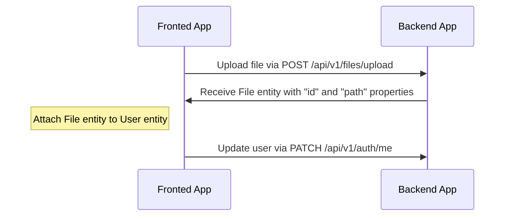
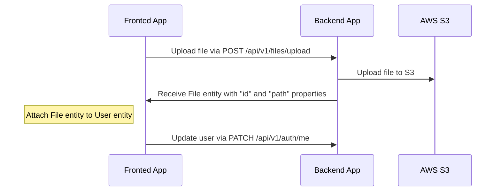
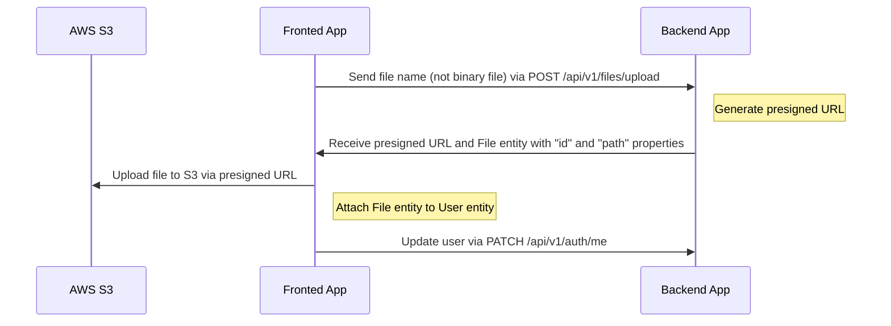
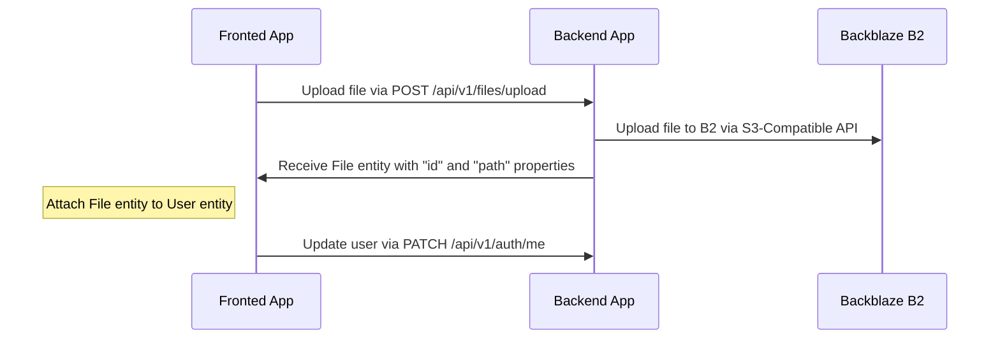
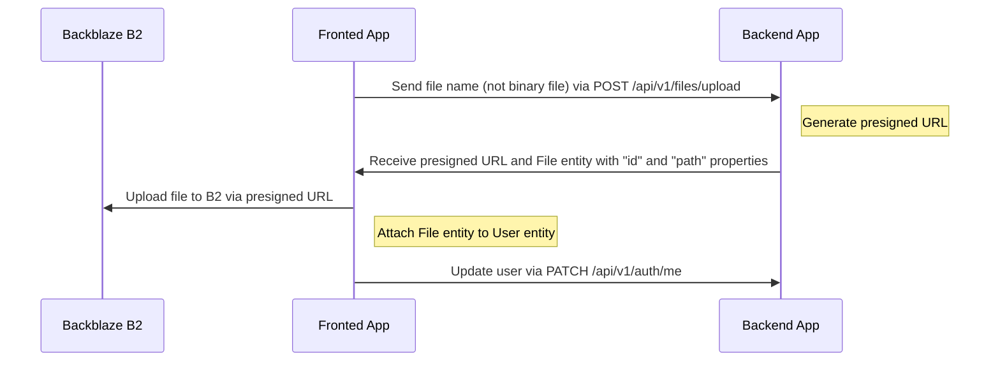

# File uploading

---

## Table of Contents <!-- omit in toc -->

- [File uploading](#file-uploading)
  - [Drivers support](#drivers-support)
  - [LMS upload endpoints (API)](#lms-upload-endpoints-api)
  - [Chunked class video uploads](#chunked-class-video-uploads)
    - [Operational notes](#operational-notes)
  - [Uploading and attach file flow for `local` driver](#uploading-and-attach-file-flow-for-local-driver)
    - [An example of uploading an avatar to a user profile (local)](#an-example-of-uploading-an-avatar-to-a-user-profile-local)
    - [Video example](#video-example)
  - [Uploading and attach file flow for `s3` driver](#uploading-and-attach-file-flow-for-s3-driver)
    - [Configuration for `s3` driver](#configuration-for-s3-driver)
    - [An example of uploading an avatar to a user profile (S3)](#an-example-of-uploading-an-avatar-to-a-user-profile-s3)
  - [Uploading and attach file flow for `s3-presigned` driver](#uploading-and-attach-file-flow-for-s3-presigned-driver)
    - [Configuration for `s3-presigned` driver](#configuration-for-s3-presigned-driver)
    - [An example of uploading an avatar to a user profile (S3 Presigned URL)](#an-example-of-uploading-an-avatar-to-a-user-profile-s3-presigned-url)
  - [Uploading and attach file flow for `b2` driver](#uploading-and-attach-file-flow-for-b2-driver)
    - [Configuration for `b2` driver](#configuration-for-b2-driver)
    - [An example of uploading an avatar to a user profile (B2)](#an-example-of-uploading-an-avatar-to-a-user-profile-b2)
  - [Uploading and attach file flow for `b2-presigned` driver](#uploading-and-attach-file-flow-for-b2-presigned-driver)
    - [Configuration for `b2-presigned` driver](#configuration-for-b2-presigned-driver)
    - [An example of uploading an avatar to a user profile (B2 Presigned URL)](#an-example-of-uploading-an-avatar-to-a-user-profile-b2-presigned-url)
    - [B2-Specific Requirements](#b2-specific-requirements)
  - [How to delete files?](#how-to-delete-files)

---

## Drivers support

Out-of-box boilerplate supports the following drivers: `local`, `s3`, `s3-presigned`, `b2`, and `b2-presigned`. You can set it in the `.env` file, variable `FILE_DRIVER`. If you want to use another service for storing files, you can extend it.

> For production we recommend using the "s3-presigned" or "b2-presigned" driver to offload your server.

---

## LMS upload endpoints (API)

The portal exposes several authenticated routes under `POST /api/v1/files/...` (JWT in `Authorization: Bearer <token>`). Each route applies its own file-type and size rules via validation pipes.

| Method | Path | Purpose |
|--------|------|---------|
| `POST` | `/api/v1/files/upload/assignment/:assignmentId` | Multiple files for an assignment |
| `POST` | `/api/v1/files/upload/submission/:submissionId` | Multiple files for a submission |
| `POST` | `/api/v1/files/upload/module/:moduleId` | Multiple files for a module |
| `POST` | `/api/v1/files/upload/profile` | Profile image |
| `POST` | `/api/v1/files/upload/course/thumbnail` | Course thumbnail |
| `POST` | `/api/v1/files/upload/course/cover` | Course cover image |
| `POST` | `/api/v1/files/upload` | General documents (PDF, Office, images; size capped in controller) |
| `POST` | `/api/v1/files/upload/video/:classId` | Single-request class video (up to 5 GB if the reverse proxy allows) |

Successful uploads return file metadata including `id`, `path`, `mimeType`, `size`, `uploadedAt`, and a resolved `url` where applicable. After upload, attach the returned `id` to domain entities (students, courses, etc.) as your feature requires.

---

## Chunked class video uploads

Large class videos should use the **chunked** flow when a single `POST` would exceed limits imposed by nginx (`client_max_body_size`), Cloudflare, or other proxies. The API splits the file into **5 MB** chunks, reassembles them on disk, then runs the same storage pipeline as `POST /api/v1/files/upload/video/:classId`, so the resulting `File` record is the same as a direct upload.

The LMS frontend uses the **single-request** class video endpoint for files up to **200 MB** and automatically switches to this chunked flow for larger files (see `uploadClassVideo` in `lms-portal-frontend/src/api/files.ts`). Custom clients can choose either path explicitly.

**Roles:** teacher, admin, or superAdmin (same as direct class video upload).

### Endpoints

All paths are prefixed with `/api/v1/files`.

1. **Initialize session** — `POST /upload/video/:classId/chunked/init`  
   **JSON body:**

   ```json
   {
     "fileName": "lecture.mp4",
     "fileSize": 524288000,
     "mimeType": "video/mp4"
   }
   ```

   `fileName` and `fileSize` are required. `mimeType` is optional (defaults when omitted).  
   **Response:**

   ```json
   {
     "uploadId": "<uuid>",
     "chunkSize": 5242880,
     "totalChunks": 100
   }
   ```

2. **Upload each chunk** — `POST /upload/video/:classId/chunked/:uploadId/chunk/:chunkIndex`  
   - `chunkIndex` is zero-based and must match the size rules: every part except the last is exactly `chunkSize` bytes; the last part holds the remainder of `fileSize`.  
   - **Multipart form** field name: `file` (binary body of that chunk only).  
   - **Response:** `{ "received": 3, "total": 100 }` (progress counters). Chunks may be sent **out of order**.

3. **Complete** — `POST /upload/video/:classId/chunked/:uploadId/complete`  
   Reassembles parts, persists via configured `FILE_DRIVER`, returns the same shape as a successful direct video upload (`id`, `filename`, `path`, `url`, etc.). The temporary session and chunk files are removed after completion.

4. **Abort** — `DELETE /upload/video/:classId/chunked/:uploadId`  
   Drops the session and temp data. Response: `{ "message": "Upload aborted" }`.

### Limits and validation

- Maximum declared file size: **5 GB** (same order of magnitude as direct video upload).
- Allowed extensions for the declared `fileName`: `mp4`, `webm`, `mov`, `avi`, `mkv`, `flv`, `wmv`, `m4v` (case-insensitive).
- Chunk temp files live under `uploads/.chunks/<uploadId>/` relative to the app working directory.

### Operational notes

- **In-memory sessions:** Upload state is kept in process memory. A **process restart** during an in-flight chunked upload invalidates `uploadId`; the client should restart from `init`. Stale sessions are garbage-collected on a timer.
- **nginx:** Example deployment config sets `client_max_body_size` to **250M** for direct uploads while individual chunk requests stay small (~5 MB). If nginx still uses a **1 MB** default elsewhere, raise it so chunk `POST`s are not rejected with `413`.
- **Production path:** Prefer chunked (or presigned direct-to-object-storage flows where implemented) when users upload very large videos through constrained networks or CDNs.

---

## Uploading and attach file flow for `local` driver

Endpoint `/api/v1/files/upload` is used for uploading files, which returns `File` entity with `id` and `path`. After receiving `File` entity you can attach this to another entity.

### An example of uploading an avatar to a user profile (local)



### Video example

<https://user-images.githubusercontent.com/6001723/224558636-d22480e4-f70a-4789-b6fc-6ea343685dc7.mp4>

## Uploading and attach file flow for `s3` driver

Endpoint `/api/v1/files/upload` is used for uploading files, which returns `File` entity with `id` and `path`. After receiving `File` entity you can attach this to another entity.

### Configuration for `s3` driver

1. Open https://s3.console.aws.amazon.com/s3/buckets
1. Click "Create bucket"
1. Create bucket (for example, `your-unique-bucket-name`)
1. Open your bucket
1. Click "Permissions" tab
1. Find "Cross-origin resource sharing (CORS)" section
1. Click "Edit"
1. Paste the following configuration

    ```json
    [
      {
        "AllowedHeaders": ["*"],
        "AllowedMethods": ["GET"],
        "AllowedOrigins": ["*"],
        "ExposeHeaders": []
      }
    ]
    ```

1. Click "Save changes"
1. Update `.env` file with the following variables:

    ```dotenv
    FILE_DRIVER=s3
    ACCESS_KEY_ID=YOUR_ACCESS_KEY_ID
    SECRET_ACCESS_KEY=YOUR_SECRET_ACCESS_KEY
    AWS_S3_REGION=YOUR_AWS_S3_REGION
    AWS_DEFAULT_S3_BUCKET=YOUR_AWS_DEFAULT_S3_BUCKET
    ```

### An example of uploading an avatar to a user profile (S3)



## Uploading and attach file flow for `s3-presigned` driver

Endpoint `/api/v1/files/upload` is used for uploading files. In this case `/api/v1/files/upload` receives only `fileName` property (without binary file), and returns the `presigned URL` and `File` entity with `id` and `path`. After receiving the `presigned URL` and `File` entity you need to upload your file to the `presigned URL` and after that attach `File` to another entity.

### Configuration for `s3-presigned` driver

1. Open https://s3.console.aws.amazon.com/s3/buckets
1. Click "Create bucket"
1. Create bucket (for example, `your-unique-bucket-name`)
1. Open your bucket
1. Click "Permissions" tab
1. Find "Cross-origin resource sharing (CORS)" section
1. Click "Edit"
1. Paste the following configuration

    ```json
    [
      {
        "AllowedHeaders": ["*"],
        "AllowedMethods": ["GET", "PUT"],
        "AllowedOrigins": ["*"],
        "ExposeHeaders": []
      }
    ]
    ```

   For production we recommend to use more strict configuration:

   ```json
   [
     {
       "AllowedHeaders": ["*"],
       "AllowedMethods": ["PUT"],
       "AllowedOrigins": ["https://your-domain.com"],
       "ExposeHeaders": []
     },
      {
        "AllowedHeaders": ["*"],
        "AllowedMethods": ["GET"],
        "AllowedOrigins": ["*"],
        "ExposeHeaders": []
      }
   ]
   ```

1. Click "Save changes"
1. Update `.env` file with the following variables:

    ```dotenv
    FILE_DRIVER=s3-presigned
    ACCESS_KEY_ID=YOUR_ACCESS_KEY_ID
    SECRET_ACCESS_KEY=YOUR_SECRET_ACCESS_KEY
    AWS_S3_REGION=YOUR_AWS_S3_REGION
    AWS_DEFAULT_S3_BUCKET=YOUR_AWS_DEFAULT_S3_BUCKET
    ```

### An example of uploading an avatar to a user profile (S3 Presigned URL)



## Uploading and attach file flow for `b2` driver

Endpoint `/api/v1/files/upload` is used for uploading files, which returns `File` entity with `id` and `path`. After receiving `File` entity you can attach this to another entity.

### Configuration for `b2` driver

1. Create a Backblaze B2 account at https://www.backblaze.com/
1. Create a bucket in the B2 console (buckets created after May 4, 2020 are S3-compatible)
1. Create an Application Key with appropriate permissions:
   - `listBuckets` (if you need to list buckets)
   - `readFiles` (for reading files)
   - `writeFiles` (for uploading files)
   - `deleteFiles` (for deleting files)
1. Note your B2 endpoint URL and region:
   - Endpoint format: `https://s3.<region>.backblazeb2.com`
   - Example: `https://s3.us-west-001.backblazeb2.com`
   - Region examples: `us-west-001`, `eu-central-003`, etc.
1. Update `.env` file with the following variables:

    ```dotenv
    FILE_DRIVER=b2
    ACCESS_KEY_ID=YOUR_B2_APPLICATION_KEY_ID
    SECRET_ACCESS_KEY=YOUR_B2_APPLICATION_KEY
    B2_ENDPOINT_URL=https://s3.us-west-001.backblazeb2.com
    B2_REGION=us-west-001
    AWS_DEFAULT_S3_BUCKET=YOUR_B2_BUCKET_NAME
    ```

> **Note**: B2 uses Application Key ID and Application Key as credentials, which are mapped to `ACCESS_KEY_ID` and `SECRET_ACCESS_KEY` respectively for S3-compatible API compatibility.

### An example of uploading an avatar to a user profile (B2)



## Uploading and attach file flow for `b2-presigned` driver

Endpoint `/api/v1/files/upload` is used for uploading files. In this case `/api/v1/files/upload` receives only `fileName` property (without binary file), and returns the `presigned URL` and `File` entity with `id` and `path`. After receiving the `presigned URL` and `File` entity you need to upload your file to the `presigned URL` and after that attach `File` to another entity.

### Configuration for `b2-presigned` driver

1. Follow steps 1-4 from the `b2` driver configuration above
1. Update `.env` file with the following variables:

    ```dotenv
    FILE_DRIVER=b2-presigned
    ACCESS_KEY_ID=YOUR_B2_APPLICATION_KEY_ID
    SECRET_ACCESS_KEY=YOUR_B2_APPLICATION_KEY
    B2_ENDPOINT_URL=https://s3.us-west-001.backblazeb2.com
    B2_REGION=us-west-001
    AWS_DEFAULT_S3_BUCKET=YOUR_B2_BUCKET_NAME
    ```

### An example of uploading an avatar to a user profile (B2 Presigned URL)



### B2-Specific Requirements

- **Bucket Compatibility**: Only buckets created after May 4, 2020 support the S3-Compatible API. Older buckets must be migrated.
- **Region Format**: B2 regions use a different format than AWS (e.g., `us-west-001` instead of `us-west-1`).
- **Endpoint URL**: Must match the format `https://s3.<region>.backblazeb2.com`.
- **Signature**: Only Signature v4 is supported (AWS SDK v3 default).
- **Bucket Naming**: B2 has stricter bucket naming rules than AWS S3.

## How to delete files?

We prefer not to delete files, as this may have negative experience during restoring data. Also for this reason we also use [Soft-Delete](https://orkhan.gitbook.io/typeorm/docs/delete-query-builder#soft-delete) approach in database. However, if you need to delete files you can create your own handler, cronjob, etc.

---

Previous: [Serialization](serialization.md)

Next: [Tests](tests.md)
